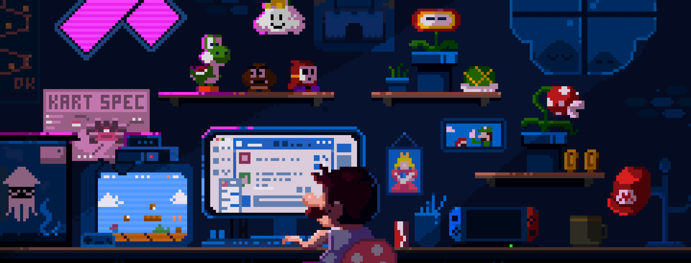

<h1> 
</h1>

  

<h1 align="left">
    
</h1>
<h3 align="center">I love everything about the exciting field of computer science. As a student, I’m always learning, from programming and cybersecurity to cloud computing. When I'm not coding, I'm either gaming or lost in music.</h3>

 🌱 I’m currently learning <strong>DevOps, Docker, Kubernetes and Jenkins</strong>

<h1> </h1>

 
     <h3> Connect with Me </h3>
  
  
  <a href="https://main--imkool.netlify.app/" target="_blank">
      <!-- sqlite, safari, google-chrome are other good icon options -->
  </a>

 

<h2 align="center">Languages and Tools    </h2>

| **Programming Languages** | **Web Development** | **Development Environments** | **Tools** | **Cloud Platforms** | **Operating Systems** | **Miscellaneous** |
|:-------------------------:|:-------------------:|:----------------------------:|:---------:|:-------------------:|:---------------------:|:-----------------:|
|  |  |  |  |  |  |  |
|  |  |  |  |  |  |  |
|  |  |  |  |  |  |  |
|  |  |  |  |  |  |  |
|  |  |  |  |  |  |  |
|  |  |  |  |  |  |  |
|  |  |  |  |  |  |  |
|  |  |  |  |  |  |  |

 

<h2 align="center">⚡ Stats ⚡    </h2>
 

  

  

  
 
<h1></h1>

  <h2>🐍 My Contributions 🐍     </h2> 
   
    <picture>
  <source
    media="(prefers-color-scheme: dark)"
    srcset="https://raw.githubusercontent.com/imkool47/imkool47/output/github-contribution-grid-snake-dark.svg"
  />
  <source
    media="(prefers-color-scheme: light)"
    srcset="https://raw.githubusercontent.com/imkool47/imkool47/output/github-contribution-grid-snake.svg"
  />
  
</picture>
<!--    -->
  
     

